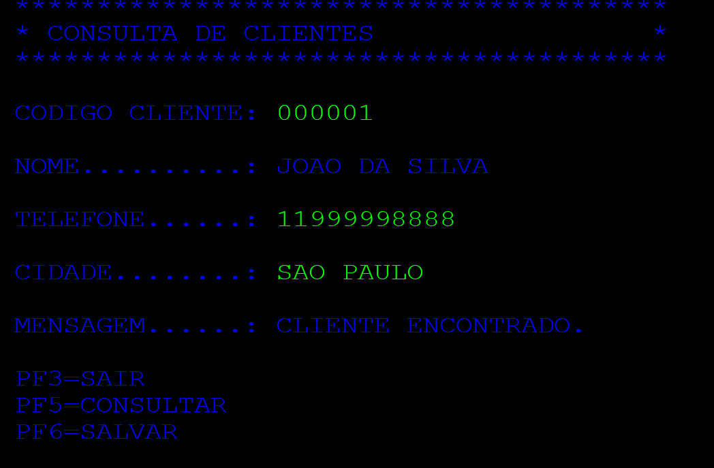
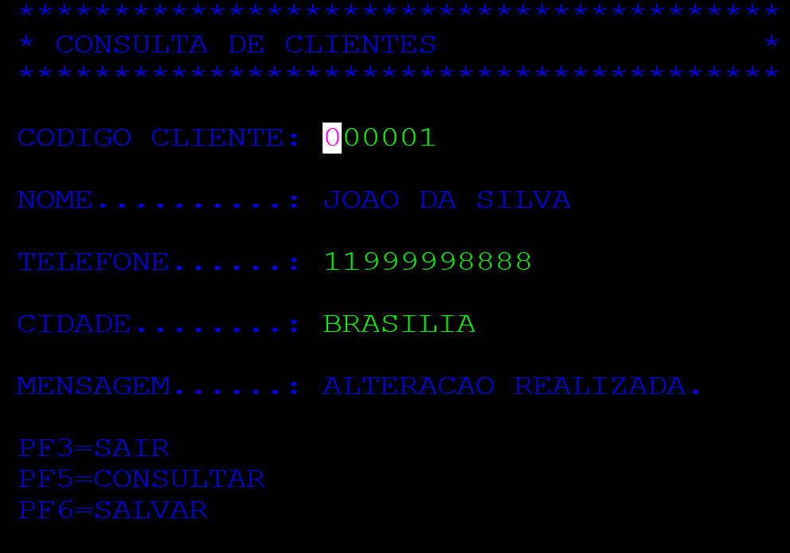
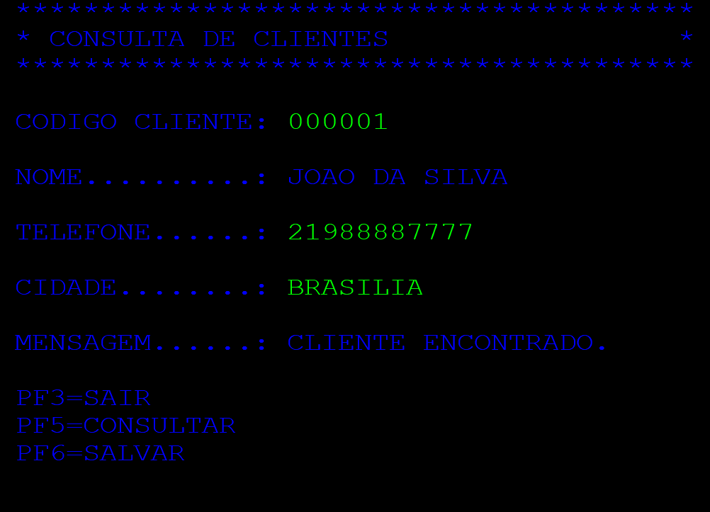
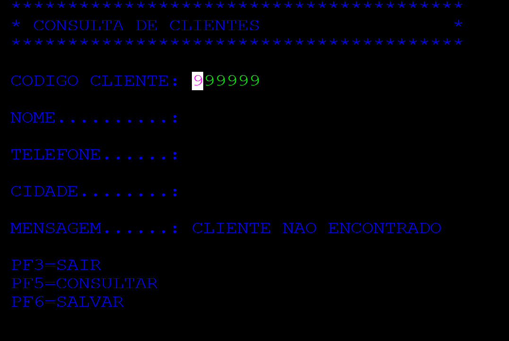
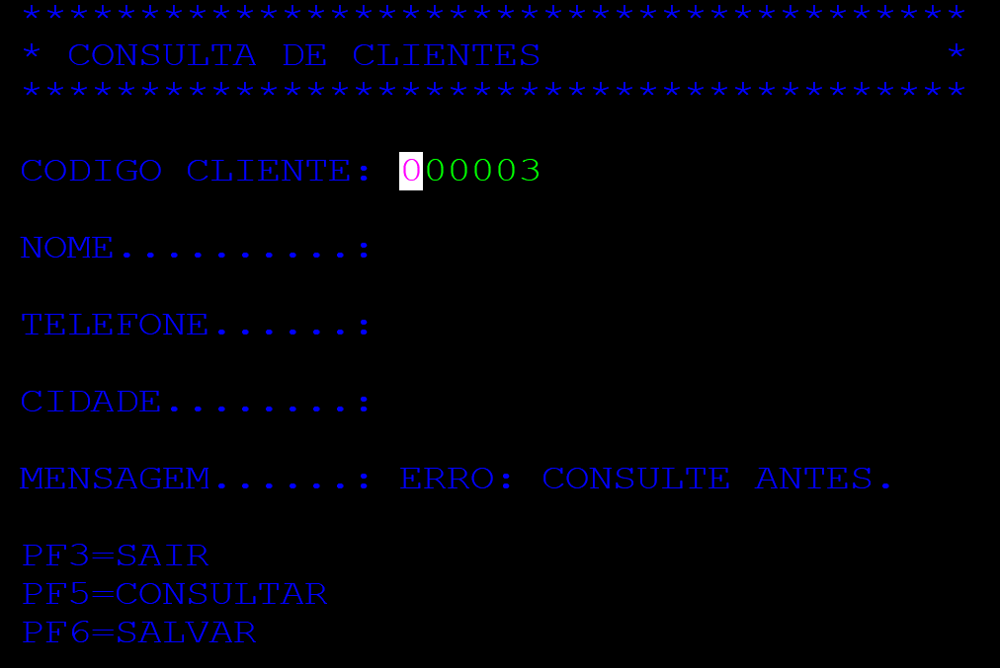

# Projeto Consulta e Atualização de Clientes em CICS

Projeto desenvolvido em COBOL no ambiente **TK5/MVS 3.8j**, utilizando **TN3270** e **KICKS** para simular o ambiente IBM CICS. 
O sistema implementa uma aplicação online pseudo-conversacional para consulta e atualização de clientes armazenados em um banco de dados VSAM. A transação `CLIE` executa o programa `CADCLI`, que interage com uma tela de terminal BMS e com o arquivo físico `CLIENTES`.

---

## Descrição
Este projeto tem como objetivo prático o desenvolvimento COBOL Online em ambiente Mainframe, utilizando transações CICS/KICKS, construção de Mapas BMS, interação com terminal 3270, e consulta/atualização de registros de arquivos VSAM. A aplicação foi executada com sucesso no ambiente TK5, garantindo a integridade dos dados através de uma lógica de persistência e validação pseudo-conversacional via COMMAREA.

---

## Demonstração

### 1. Consultando um cliente (PF5)

### 2. Editando cliente e o salvando (PF6)

### 3. Confirmando a alteração

### 4. Tratamento de Busca para Cliente inexistente

### 5. Tratamento de Comando Salvar

---

## Tela do Sistema (BMS)

## Funcionamento
A aplicação utiliza a arquitetura Pseudo-Conversacional, onde o programa não retém a memória do servidor enquanto aguarda a ação do usuário. O controle de estado é gerenciado via DFHCOMMAREA.
Ao executar a transação CLIE, o sistema apresenta a tela de consulta. O usuário informa o código de 6 dígitos numéricos e utiliza as teclas de função:

    PF5 (Consultar): Valida a entrada, acessa o VSAM pela chave (CODCLI) e retorna os dados.
        Se encontrado: Traz os dados e emite CLIENTE ENCONTRADO.
        Se não encontrado: Limpa os dados e emite CLIENTE NAO ENCONTRADO.

    PF6 (Salvar): Valida a COMMAREA para garantir que o usuário consultou o cliente previamente (evitando erro de Modified Data Tag - MDT). Atualiza o Telefone e a Cidade e grava fisicamente no arquivo.
        Sucesso: ALTERACAO REALIZADA.
        Falha de Validação: ERRO: CONSULTE ANTES.

    PF3 (Sair): Limpa o mapa da tela graciosamente e encerra o fluxo do programa, devolvendo o controle ao terminal.

## Comandos CICS / KICKS Utilizados
Durante o desenvolvimento do código COBOL (CADCLI), as seguintes instruções CICS foram implementadas para garantir a comunicação com o Terminal e com o Disco:

    EXEC CICS SEND MAP: Para envio do mapa BMS (tela) para o terminal do usuário.
    EXEC CICS RECEIVE MAP: Para captura das informações digitadas no terminal.
    EXEC CICS READ DATASET: Leitura do arquivo VSAM com o uso da chave (RIDFLD).
    EXEC CICS READ DATASET UPDATE e EXEC CICS REWRITE: Mecanismo de lock de registro para atualização e reescrita segura no VSAM.
    EXEC CICS RETURN: Para devolução de controle ao KICKS, repassando o estado atual via COMMAREA.
    EXEC CICS SEND CONTROL ERASE FREEKB: Para limpeza total do terminal na saída da transação (PF3), evitando abends de MAPFAIL.

## Arquivos do Projeto

src/CADCLI.cbl
Código-fonte do programa COBOL principal.

src/MAPSCA.bms	
Código-fonte do Mapa BMS da tela.

jcl/DEFVSAM.jcl	
JCL com utilitário IDCAMS para definição de cluster e carga do arquivo VSAM.

jcl/JCLMAP.jcl	
JCL de compilação/montagem do Mapa BMS.

jcl/CADCLI.jcl
JCL de compilação do código COBOL chamando a procedure do KICKS.

jcl/ASMCLIE.jcl
JCL responsável por gerar e registrar o projeto nas tabelas do sistema KICKS.

## Configuração de apoio usada no KICKS

Para a aplicação funcionar no emulador KICKS for TSO, além dos programas, as tabelas internas do CICS precisaram ser atualizadas via Assembler (jcl/ASMCLIE.jcl). O sufixo utilizado na Link-Edição foi o 1$ para sobrepor a tabela padrão do servidor:

    PCT (Program Control Table): Transação CLIE atrelada ao programa CADCLI.
    PPT (Processing Program Table): Registro do programa CADCLI e do mapa MAPSCA.
    FCT (File Control Table): Registro e permissões de acesso ao Dataset CLIENTES (Acesso VSAM).
